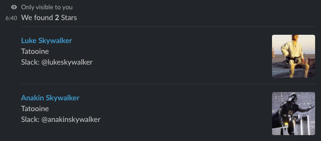

# Hackathon Slack Bot

Slack bot to get user details.

Inspiration: [https://github.com/jainishshah17/slack-weather-bot](https://github.com/jainishshah17/slack-weather-bot)

## Prerequisites

- [NodeJs](https://nodejs.org/en/)
- [Ngrok](https://ngrok.com/)
- [Slack Workspace](https://slack.com/)

## Getting started

- Checkout code:

```bash
git checkout https://github.com/budavariam/hackathon-slack-bot.git
```

- Install Npm dependencies:

```bash
cd hackathon-slack-bot
npm install
```

- Create Slack App

  1. Go to [https://api.slack.com/apps](https://api.slack.com/apps)
  1. Create New App:
     Name: Hackathon
     Development Slack Workspace: Choose your workspace
  1. Add preferred logo and description: "Get User info by searchstring."
  1. Copy `Signing Secret` and store it in [.env](.env-example) file.
  1. Go to Basic Information -> Add Features and functionality -> add Slash commands
  1. Go to Features -> OAuth & Permissions -> OAuth Tokens & Redirect URLs.
     Then copy `OAuth Access Token` and store it in [.env](.env-example) file.

- Start app server

  ```bash
  npm start
  ```

- Install and run Ngrok

```bash
npm install -g ngrok
ngrok http 3333

## You will see output like following
ngrok by @inconshreveable     (Ctrl+C to quit)

Session Status                online
Session Expires               7 hours, 59 minutes
Version                       2.3.40
Region                        Europe (eu)
Web Interface                 http://127.0.0.1:4040
Forwarding                    http://c1219f73.ngrok.io -> http://localhost:3333
Forwarding                    https://c1219f73.ngrok.io -> http://localhost:3333

Connections                   ttl     opn     rt1     rt5     p50     p90
                              0       0       0.00    0.00    0.00    0.00
```

- Create [Slash Command](https://api.slack.com/apps/) in Hackathon Slack App we created
  1. Go to Features -> Slash Commands -> Click on Create New Command
     - Provide following details for new slash command:
     - Command: `/whois`
     - Request URL: `https://c1219f73.ngrok.io/` (**Note**:Use your ngrok generated HTTPS URL)
     - Short Description: `Get User info by searchstring.`
     - Usage Hint: `[searchstring]`

  1. Go to slack and type `/whois sky` to see the magic!

     
